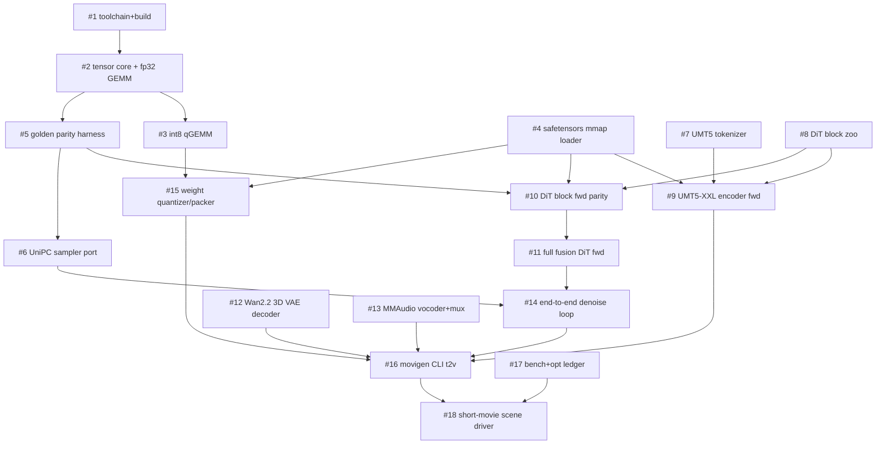

# Issue / dependency graph

Mermaid: `A --> B` means "A is a dependency of B".

| # | Issue | Milestone | Depends on |
|---|-------|-----------|------------|
| 1 | Toolchain + Makefile + CI-green `make test` | M0 | — |
| 2 | Tensor core: Tensor, blocked+SIMD threaded fp32 GEMM, bf16↔fp32 | M0 | 1 |
| 3 | Int8 qGEMM (s8s8→s32, per-channel scales) + accuracy test | M0 | 2 |
| 4 | Safetensors mmap loader (bf16/f32/f8) | M0 | 1 |
| 5 | Golden parity harness (numpy ref → npz → C++ tests) | M0 | 2 |
| 6 | UniPC sampler port from `Ovi/ovi/utils/fm_solvers_unipc.py` | M0 | 5 |
| 7 | UMT5 sentencepiece unigram tokenizer | M0 | 1 |
| 8 | DiT block zoo: RMSNorm, RoPE-3D, SDPA, AdaLN, FFN, cross-attn | M0 | 2 |
| 9 | UMT5-XXL encoder forward pass | M1 | 4, 7, 8 |
| 10 | DiT block forward parity vs golden | M1 | 4, 5, 8 |
| 11 | Full 28-layer dual-backbone fusion DiT forward | M1 | 10 |
| 12 | Wan2.2 causal 3D VAE decoder | M2 | 2, 4, 8 |
| 13 | MMAudio vocoder + audio mux | M2 | 2, 4, 8 |
| 14 | UniPC end-to-end denoise loop | M2 | 6, 11 |
| 15 | Weight quantizer: bf16 safetensors → int8 .sdcpp pack | M2 | 3, 4 |
| 16 | `movigen` CLI: text → mp4 (with audio) | M3 | 9, 11, 12, 13, 14, 15 |
| 17 | Benchmarks + optimization ledger (TFLOPS vs 0.16 ceiling) | M3 | 2, 3 |
| 18 | Short-movie driver: scene script → stitched clips | M3 | 16, 17 |

Session-1 target: close #1–#8, file #9–#18 with detailed specs.
